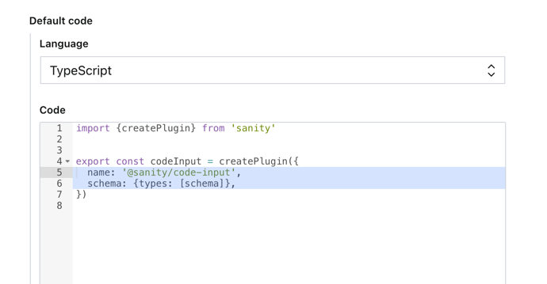
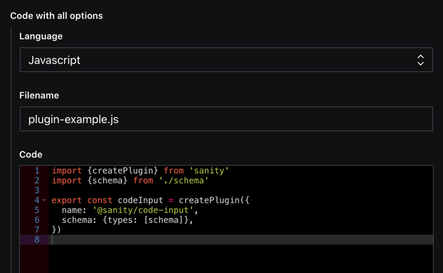

# @sanity/code-input

> This is a **Sanity Studio v3** plugin.
> For the v2 version, please refer to the [v2-branch](https://github.com/sanity-io/sanity/tree/next/packages/%40sanity/code-input).

## What is it?

Code input for [Sanity](https://sanity.io/).

A subset of languages and features are exposed by default. More can be added via the plugin options.



Click the line numbers to toggle line highlighting.

## Installation

```sh
npm install @sanity/code-input
```

## Usage

Add it as a plugin in `sanity.config.ts` (or .js):

```js
import {codeInput} from '@sanity/code-input'

export default defineConfig({
  // ...
  plugins: [codeInput()],
})
```

Now you can use the `code` type in your schema types:

```js
import {defineType, defineField} from 'sanity'

defineType({
  // [...]
  fields: [
    defineField({
      type: 'code',
      name: 'myCodeField',
      title: 'My code field',
    }),
  ],
})
```

## Options

- `language` - Default language for this code field.
- `languageAlternatives` - Array of languages that should be available (se its format in the example below)
- `withFilename` - Boolean option to display input field for filename

```js
//...fields,
defineField({
  type: 'code',
  name: 'myCodeField',
  title: 'Code with all options',
  options: {
    language: 'javascript',
    languageAlternatives: [
      {title: 'Javascript', value: 'javascript'},
      {title: 'HTML', value: 'html'},
      {title: 'CSS', value: 'css'},
    ],
    withFilename: true,
  },
})
```



## Add support for more languages

Only a subset of languages are have syntax highlighting support by default (see full list [here](https://github.com/sanity-io/code-input/blob/main/src/codemirror/defaultCodeModes.ts)).

### Mode: Reuse an existing language

Some languages are similar enough, that reusing one of the default highlighters will be "good enough".
To reuse an existing language, specify mode for a value in `languageAlternatives`:

```js
//...fields,
defineField({
  name: 'zhOnly',
  type: 'code',
  options: {
    language: 'zh',
    languageAlternatives: [
      //Adds support for zh language, using sh syntax highlighting
      {title: 'ZH', value: 'zh', mode: 'sh'},
    ],
  },
})
```

### Add more languages

You can add support for additional languages, or override existing ones, by providing a `codeModes` array to the plugin.
`codeModes` should be an array where each value is an object with a name and a loader function.
The loader function should return a codemirror `Extension` or a `Promise` that resolves to `Extension`.

The loader function will be invoked when the language is selected.

For a full list of officialy code-mirror languages, see:

### Example: Add support for CodeMirror 6 language (Angular)

We can add support for a [CodeMirror 6 lang package](https://github.com/orgs/codemirror/repositories?language=&q=lang-&sort=&type=all):

```js
// sanity.config.js

// ... in the plugins array of defineConfig, where we add the codeInput plugin
codeInput({
  codeModes: [
    {
      name: 'angular',
      // dynamic import the angular package, and initialize the plugin after it is loaded
      // This way, the language is only when it is selected
      loader: () => import('@codemirror/lang-angular').then(({angular}) => angular()),
    },
  ],
})
```

```js
// in a code field, you can now use rust as a language as a value, or mode
defineField({
  name: 'exampleRust',
  title: 'Example usage',
  type: 'code',
  options: {
    languageAlternatives: [
      {title: 'Javascript', value: 'javascript'},
      {title: 'Angular', value: 'angular'},
      {title: 'Angular-like', value: 'angular-like', mode: 'angular'}, // uses angular highlighter
    ],
  },
})
```

For this to work, you will have to run `npm i @codemirror/lang-angular` as this package is not included by @sanity/code-input.

### Example: Add support for CodeMirror 5 legacy language (Rust)

We can add support for any [CodeMirror 5 legacy language](https://github.com/codemirror/legacy-modes/tree/main/mode) using
[CodeMirror 6 StreamLanguage](https://codemirror.net/docs/ref/#language.StreamLanguage).

```js
// sanity.config.js
import {StreamLanguage} from '@codemirror/language'

// ... in the plugins array of defineConfig, where we add the codeInput plugin
codeInput({
  codeModes: [
    {
      name: 'rust',
      // dynamic import so the language is only be loaded on demand
      loader: () =>
        import('@codemirror/legacy-modes/mode/rust').then(({rust}) => StreamLanguage.define(rust)),
    },
  ],
})
```

```js
// in a code field, you can now use rust as a language as a value, or mode
defineField({
  name: 'exampleRust',
  title: 'Example usage',
  type: 'code',
  options: {
    languageAlternatives: [
      {title: 'Javascript', value: 'javascript'},
      {title: 'Rust', value: 'rust'},
      {title: 'Rust-like', value: 'rust-like', mode: 'rust'}, // uses rust highlighter
    ],
  },
})
```

Note: `@sanity/code-input` already includes the `@codemirror/legacy-modes` and `@codemirror/language` dependencies,
so no need to install them explicitly.

## Data model

```js
{
  _type: 'code',
  language: 'js',
  highlightedLines: [1, 2],
  code: 'const foo = "bar"\nconsole.log(foo.toUpperCase())\n// BAR',
  filename: 'available when enabled'
}
```

## Example usage in frontend (React)

You can use any syntax highlighter you want - but not all of them might support highlighted lines or the syntax you've defined.

As outlined above, the actual code is stored in a `code` property, so if your schema has a field called `codeExample` of type `code`, the property you'd want to pass to the highlighter would be `codeExample.code`.

Here's an example using [react-refractor](https://github.com/rexxars/react-refractor):

```jsx
import React from 'react'
import Refractor from 'react-refractor'
import js from 'refractor/lang/javascript'

Refractor.registerLanguage(js)

export function Code(props) {
  return (
    <Refractor
      // In this example, `props` is the value of a `code` field
      language={props.language}
      value={props.code}
      markers={props.highlightedLines}
    />
  )
}
```

Other syntax highlighters include:

- [react-lowlight](https://github.com/rexxars/react-lowlight)
- [react-syntax-highlighter](https://github.com/react-syntax-highlighter/react-syntax-highlighter)
- [highlight.js](https://github.com/highlightjs/highlight.js)
- [prism](https://github.com/PrismJS/prism)

## License

MIT-licensed. See LICENSE.

## Develop & test

This plugin uses [@sanity/plugin-kit](https://github.com/sanity-io/plugin-kit)
with default configuration for build & watch scripts.

See [Testing a plugin in Sanity Studio](https://github.com/sanity-io/plugin-kit#testing-a-plugin-in-sanity-studio)
on how to run this plugin with hotreload in the studio.

### UI Workshop
Run
`workshop dev`

To test the CodeMirror lazy component.

### Release new version

Run ["CI & Release" workflow](https://github.com/sanity-io/code-input/actions/workflows/main.yml).
Make sure to select the main branch and check "Release new version".

Semantic release will only release on configured branches, so it is safe to run release on any branch.
